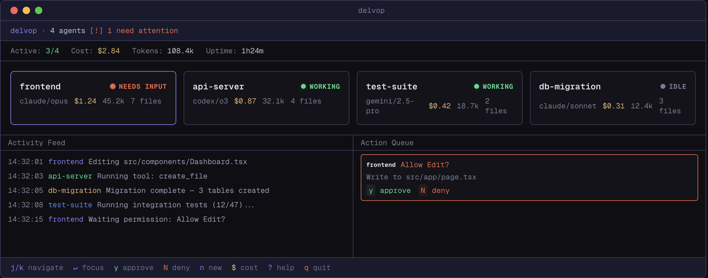

<p align="center">
  
</p>

<p align="center">
  <strong>Engineering Command Center for Terminal Coding Agents</strong>
</p>

<p align="center">
  <a href="https://github.com/delvop-dev/delvop/actions/workflows/ci.yml"></a>
  <a href="https://github.com/delvop-dev/delvop/releases"></a>
  <a href="https://www.npmjs.com/package/@delvop/cli"></a>
  <a href="https://github.com/delvop-dev/delvop/blob/main/LICENSE"></a>
</p>

<p align="center">
  <em>Manage a team of AI coding agents from a single terminal dashboard.<br>A keyboard-driven TUI that turns your terminal into an engineering war room.</em>
</p>

<p align="center">
  
</p>

---

## Highlights

- **Unified dashboard** -- See all your agents at a glance. State, cost, tokens, changed files, and activity feed in one view.
- **Agent-agnostic** -- Works with Claude Code, Codex CLI, Gemini CLI, and any terminal agent. One interface to manage them all.
- **Approve from anywhere** -- Permission requests surface in a single action queue. Approve or deny without switching terminals.
- **Native notifications** -- macOS and Linux desktop notifications with sound. Know instantly when an agent needs you.
- **Zero config** -- Sensible defaults, optional TOML config. No Electron, no desktop app. One binary.

## Quick Start

```bash
# Install
brew install go tmux  # prerequisites
go install github.com/delvop-dev/delvop@latest

# Launch
delvop
```

Press `n` and type `frontend: build the auth flow` — agent starts working immediately. Press `enter` to attach to the terminal. `Ctrl+\` to detach back to the dashboard.

## Installation

### From source (recommended)

```bash
go install github.com/delvop-dev/delvop@latest
```

### npm

```bash
npm install -g @delvop/cli
```

### From release binary

Download from [GitHub Releases](https://github.com/delvop-dev/delvop/releases), extract, and add to your PATH.

### Build from source

```bash
git clone https://github.com/delvop-dev/delvop.git
cd delvop
make build
./delvop
```

### Prerequisites

- **Go 1.22+** (build)
- **tmux** (runtime)

## Usage

### The Mental Model

You are the engineering director. Agents are your direct reports.

| You think...           | In delvop...                                    |
|------------------------|------------------------------------------------|
| "Hire someone"         | `n` -- new agent                               |
| "Check on everyone"    | The dashboard -- always visible                |
| "Unblock someone"      | `y` / `N` -- approve or deny from action queue |
| "Talk to someone"      | `m` -- message an agent                        |
| "Deep dive"            | `enter` -- focus view, then raw terminal       |
| "Check the budget"     | KPI bar -- cost and token usage at a glance    |

### Key Bindings

#### Dashboard

| Key | Action |
|-----|--------|
| `j/k` `↑/↓` | Navigate agents |
| `enter` | Attach to agent terminal |
| `n` | New agent (`name: task` format) |
| `t` | Deploy from template |
| `y` | Approve permission |
| `N` | Deny permission |
| `m` | Message agent |
| `c` | Compact context |
| `x` | Kill agent |
| `?` | Help |
| `q` | Quit (kills all agents) |

#### Attached Terminal

| Key | Action |
|-----|--------|
| `Ctrl+\` | Detach back to dashboard |

### Templates

Deploy pre-configured agent teams:

```bash
# Built-in templates
delvop  # then press 't'
```

```toml
# ~/.delvop/templates/my-team.toml
name = "my-team"
description = "Custom agent setup"

[[sessions]]
name = "architect"
provider = "claude"
model = "opus"
initial_prompt = "Design the system"

[[sessions]]
name = "builder"
provider = "gemini"
model = "2.5-pro"
initial_prompt = "Implement the design"
```

### Configuration

Optional. Everything works with defaults. Place at `~/.delvop/config.toml`:

```toml
[general]
default_provider = "claude"    # claude, codex, gemini
default_model = "opus"
poll_interval_ms = 500

[notify]
channels = []  # add "native", "sound" to enable
focus_suppress = true

[notify.sound]
input_needed = "Basso"
task_done = "Glass"
error = "Sosumi"

[cost]
daily_budget = 50.0
```

## How It Works

delvop wraps each coding agent in an isolated **tmux session**. A provider interface abstracts agent-specific behavior -- state detection, permission parsing, cost tracking. The TUI polls tmux panes every 500ms and cross-validates with hook events via a Unix socket.

```
┌─────────────┐     ┌──────────────┐     ┌──────────────┐
│  delvop TUI │────▶│ Session Mgr  │────▶│  tmux panes  │
│  (Bubbletea)│     │              │     │  (agents)    │
│             │◀────│  Provider    │◀────│              │
│             │     │  Interface   │     │ claude, codex│
│             │     │              │     │ gemini, ...  │
└─────────────┘     └──────────────┘     └──────────────┘
                           ▲
                    ┌──────┴──────┐
                    │ Hook Engine │
                    │ (Unix sock) │
                    └─────────────┘
```

No daemon. No Electron. One Go binary.

## Adding Providers

Implementing a new agent provider is one file with 9 methods:

```go
type AgentProvider interface {
    Name() string
    LaunchCmd(model string) string
    InjectHooks(workDir, sessionID, socketPath string) error
    ParseState(paneContent string) AgentState
    ParsePermission(paneContent string) *PermissionRequest
    ParseCost(paneContent string) (costUSD float64, tokIn, tokOut int64)
    CompactCmd() string
    ApproveKey() string
    DenyKey() string
}
```

Create your file in `internal/provider/`, implement the interface, call `Register("name", &YourProvider{})` in `init()`. Done.

## Roadmap

- **v0.1** -- Core TUI, session management, state detection, notifications *(current)*
- **v0.2** -- Command palette, template picker UI, cost report overlay, session resume
- **v0.3** -- `delvop web` localhost dashboard, dependency tracking, auto-compact
- **v0.4** -- Multi-provider templates, agent-to-agent messaging, plugin system

## Contributing

```bash
git clone https://github.com/delvop-dev/delvop.git
cd delvop
make test    # run tests
make build   # build binary
make run     # build and run
```

Issues and PRs welcome at [github.com/delvop-dev/delvop](https://github.com/delvop-dev/delvop/issues).

## License

[MIT](LICENSE)
